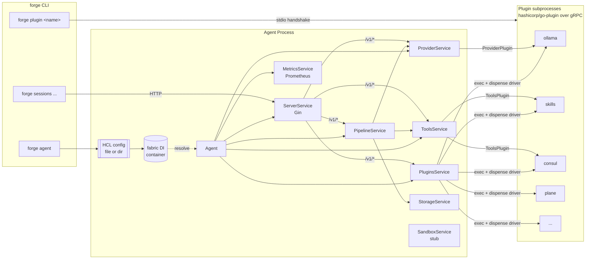
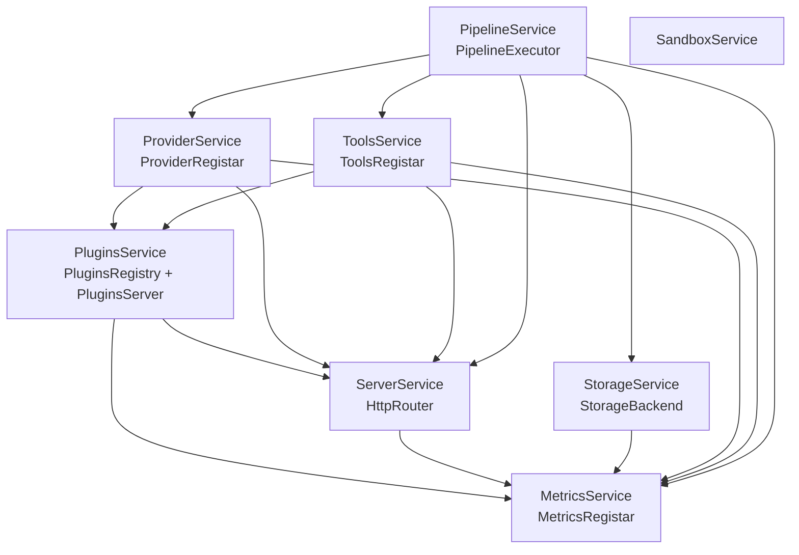
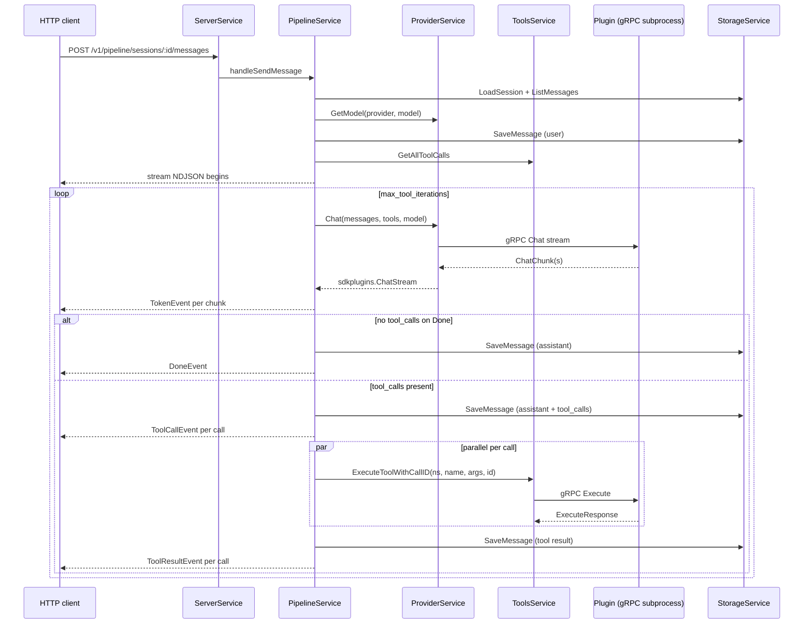
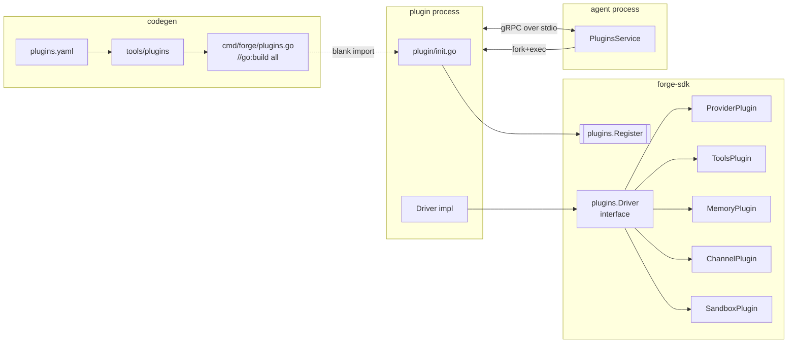

# CLAUDE.md — `service/` (Forge agent)

Guidance for Claude Code working inside `service/`. The monorepo root has its own `CLAUDE.md` with a wider view; this file covers only the main agent binary.

> **Current state (2026-04):** The service has been restructured into a DI-container driven, modular **service-per-subsystem** layout (`internal/service/*`). The old monolithic packages (`internal/registry`, `internal/server`, `internal/session`, `internal/metrics`, `internal/storage`, `internal/sandbox`, `internal/channel`) are gone — the deletions still show up in `git status` until the working tree is committed. Anything still living in `old_code/` is reference material, not a build target.

## Build Commands

Uses [Task](https://taskfile.dev/) and Go 1.25+.

```bash
task setup      # go mod download && go mod tidy
task generate   # regenerate cmd/forge/plugins.go + swagger docs
task build      # generate + compile static binary -> ./build/forge
task run        # generate + go run with tests/config/
task release    # multi-arch docker buildx push
```

Direct:

```bash
# Manifest-driven plugin imports + swagger
go run ./tools/plugins -manifest plugins.yaml -out cmd/forge
swag init -g cmd/forge/main.go -o docs --parseInternal

# Build (the `all` tag enables every generated plugin import)
CGO_ENABLED=0 GOOS=linux go build -tags all -trimpath \
    -ldflags '-s -w -extldflags "-static"' \
    -o ./build/forge ./cmd/forge

go run -tags all ./cmd/forge agent --config ./tests/config/ --log-level DEBUG
```

`plugins.yaml` is the source of truth for which plugins get compiled in. The generator writes `cmd/forge/plugins.go` with `//go:build all` and blank-imports each plugin's `plugin` subpackage; each of those packages calls `plugins.Register(...)` in its `init()`.

## High-Level Architecture



### Service interface

All subsystems in `internal/service/*` implement:

```go
type Service interface {
    container.LifecycleService  // Init(ctx) error + Cleanup(ctx) error
    Serve(ctx context.Context) error
}
```

`service.UnimplementedService` gives no-op defaults. Each subsystem registers itself in `init()` via `container.Register[*T](container.AsSingleton(), container.With[Iface]())`, exposing a narrow interface that other services depend on.

### DI container (fabric)

The project uses `github.com/mwantia/fabric/pkg/container`. Struct tags wire dependencies at resolve time:

| Tag | Meaning |
|---|---|
| `fabric:"inject"` | Resolve another singleton by its registered interface/type. |
| `fabric:"config"` | Inject the full `*config.AgentConfig`. |
| `fabric:"config:<block>"` | Decode the named HCL block (via `ConfigTagProcessor`) into the field's type. Slice fields collect all matching blocks; scalar fields take the first. |
| `fabric:"logger:<name>"` | Named `hclog.Logger` child. |

The `ConfigTagProcessor` (`internal/config/processor.go`) is registered globally at `init()` and given the parsed `*AgentConfig` via `config.SetConfig()` right after `config.Parse()` returns. That timing matters — nothing may call `container.Resolve` before `SetConfig` runs.

### Sub-service dependency graph



Agent (`internal/agent/agent.go`) is the top-level orchestrator. It:

1. Calls `plugins.ServePluginsFrom(ctx, cfg.PluginDir)` to launch every enabled plugin subprocess and cache the driver handles.
2. Calls `providers.Serve(ctx)` and `toolsSvc.Serve(ctx)` to enumerate loaded drivers and pull `ProviderPlugin`/`ToolsPlugin` handles + tool definitions.
3. Spawns goroutines for `ServerService.Serve`, `MetricsService.Serve`, and `PipelineService.Serve`.
4. On shutdown, calls `Cleanup` on plugins, server, and metrics.

`container.LifecycleService.Init(ctx)` runs once per singleton during resolution and is where each service wires routes, registers metrics, and reads config.

## Session Pipeline



**Tool naming:** tools are registered as `namespace__name` (double underscore, e.g. `skills__list_files`). `PipelineService.executeToolCall` splits on `__` to find the registrar entry. This differs from the old `namespace/name` convention documented in `old_code`.

**Streaming format:** `POST /v1/pipeline/sessions/:id/messages` responds with `application/x-ndjson`. Each line is a `WireEvent { type, data }` — see `pipeline/events.go` for the envelope and concrete event shapes (`TokenEvent`, `ToolCallEvent`, `ToolResultEvent`, `ErrorEvent`, `DoneEvent`).

## Plugin System



- **Packaging:** each plugin lives in a sibling module (`plugins/<name>/`) and publishes a `plugin` subpackage whose `init()` calls `plugins.Register(name, description, factory)`. Blank-imported plugins can be served from the same binary via `forge plugin <name>`. Out-of-tree plugins remain standalone binaries placed under `plugin_dir` and named to match the block's `type` label.
- **Runtime:** `PluginsService.ServePluginsFrom` iterates `PluginConfig` blocks, resolves the binary path (explicit `runtime { path = ... }`, then `<plugin_dir>/<type>`, then falls back to `os.Executable() plugin <type>` for embedded plugins), launches it via `hashicorp/go-plugin` with the `pluginsgrpc.Handshake` + `pluginsgrpc.Plugins`, dispenses the `driver`, calls `ConfigDriver` + `OpenDriver`, and caches the handle with capabilities.
- **Capability gating:** `ProviderService.Serve` and `ToolsService.Serve` both skip drivers whose `DriverCapabilities.Provider` / `.Tools` is nil. Memory, Channel, and Sandbox plugin types are declared in the SDK and tracked in `PluginType` constants, but no service currently consumes them.

## Configuration

HCL. A single file or a directory of `*.hcl` files (merged top-level attributes + blocks).

```hcl
# top-level
plugin_dir = "./plugins"

# reusable constants accessible as meta.* inside other blocks (WIP — see
# processor.go TODO)
meta {
  env = "dev"
}

server {
  address = "127.0.0.1:9280"
  token   = "optional-bearer"
  swagger { path = "/swagger" }
}

metrics {
  address = "127.0.0.1:9500"
  token   = ""
}

storage "file" {
  path = "./data"
}

provider {
  model "prometheus" {
    base_model = "ollama/glm-5.1:cloud"
    reasoning  = true
    system     = "..."
    options { temperature = 0.7 }
    cost_per_input_token  = 0
    cost_per_output_token = 0
  }
}

pipeline {
  max_tool_iterations = 10
  builtin_prompts     = []
}

plugin "ollama" "ollama" {
  # optional — per-plugin runtime overrides
  runtime {
    path    = "/opt/forge/plugins/ollama"
    timeout = "30s"
    port { min = 10000  max = 25000 }
    env { OLLAMA_HOST = "http://127.0.0.1:11434" }
  }

  # driver-specific HCL body passed as map[string]any to ConfigDriver
  config {
    address = "http://127.0.0.1:11434"
  }
}
```

HCL values resolve through `forge-sdk/pkg/template` — `${env("X")}`, `${now()}`, `${uuid()}`, `${file("./x")}` and friends are available inside plugin `env` / `config` blocks and in the top-level eval.

**Model routing.** `PipelineService` splits `session.Metadata.Model` on `/` into `provider/model`. `ProviderService` adds a virtual `forge/` namespace: `forge/<alias>` looks up `provider { model "<alias>" { ... } }` and re-dispatches to the real provider using `base_model` (with `<provider>/` prefix stripped).

**Model aliases.** The `provider { model "..." }` block defines a named alias: `base_model` is the underlying provider model, `system` is prepended as a system message, `options` becomes generation parameters, and `cost_per_*_token` feeds usage accounting.

## HTTP API

Mounted under `/v1/`. The `ServerService` exposes two Gin groups — `public` (unauthenticated) and `auth` (bearer-required when `server.token != ""`). Sub-services mount their own subgroups via `HttpRouter.AuthGroup(prefix)`.

```
GET    /v1/health                                     # public

GET    /v1/plugins
GET    /v1/plugins/:name
GET    /v1/plugins/:name/capabilities

GET    /v1/provider
GET    /v1/provider/models
GET    /v1/provider/:name
GET    /v1/provider/:name/models
GET    /v1/provider/:name/models/:model

GET    /v1/tools
GET    /v1/tools/:namespace
GET    /v1/tools/:namespace/:name
POST   /v1/tools/:namespace/:name/execute
POST   /v1/tools/:namespace/:name/execute/:callid

GET    /v1/pipeline/sessions
POST   /v1/pipeline/sessions
GET    /v1/pipeline/sessions/:id
DELETE /v1/pipeline/sessions/:id
GET    /v1/pipeline/sessions/:id/tools
GET    /v1/pipeline/sessions/:id/tools/:namespace
GET    /v1/pipeline/sessions/:id/messages              # list
POST   /v1/pipeline/sessions/:id/messages              # send -> NDJSON stream
GET    /v1/pipeline/sessions/:id/messages/:msg_id
PATCH  /v1/pipeline/sessions/:id/messages/compact
PATCH  /v1/pipeline/sessions/:id/messages/summarize    # 501 not implemented
```

Swagger UI at `GET /swagger/index.html` when `server { swagger {} }` is set.

Prometheus: `GET /metrics` on the metrics server, with optional bearer `metrics { token = "..." }`.

## Storage

`StorageBackend` is a flat K/V-with-prefix interface (`ReadRaw/ReadJson/WriteRaw/WriteJson/CreateEntry/ListEntry/DeleteEntry/DeletePrefix`). The `file` backend maps keys directly onto `filepath.Join(root, key)`. Sessions and messages are persisted by `PipelineStorageManager` (`pipeline/storage.go`) under key prefixes — zero-padded unix-nano prefixes on message keys give chronological ordering from a plain `ListEntry`.

Swapping in a new backend = add a `case "kv"` branch in `StorageService.Init` returning a type that implements `StorageBackend`. Everything else — metrics, pipeline, whatever else gets wired up later — goes through the injected `StorageBackend` interface.

## Key Files

| Path | Role |
|---|---|
| `cmd/forge/main.go` | Cobra root. Blank-imports every `internal/service/*` package to trigger their `init()` registrations. |
| `cmd/forge/server/agent.go` | `forge agent`: parse config → `SetConfig` → `container.Resolve[*Agent]` → `Serve`. |
| `cmd/forge/server/plugin.go` | `forge plugin`: serve a compiled-in plugin as a subprocess. |
| `cmd/forge/client/sessions.go` | `forge sessions` HTTP client commands. |
| `internal/agent/agent.go` | Orchestrator; owns the Serve/Cleanup lifecycle. |
| `internal/config/parse.go` | HCL file + directory parsing. |
| `internal/config/processor.go` | `fabric:"config:<block>"` tag resolver. |
| `internal/service/service.go` | Core `Service` interface. |
| `internal/service/plugins/serve.go` | Plugin subprocess lifecycle. |
| `internal/service/pipeline/pipeline.go` | LLM + tool-call loop, event emission. |
| `internal/service/pipeline/handlers.go` | HTTP handlers; builds the system-message chain and drives NDJSON streaming. |
| `internal/service/provider/registar.go` | Model aliasing, `forge/` virtual namespace, Chat/Embed dispatch. |
| `internal/service/tools/registar.go` | `namespace__name` registration + execution. |
| `internal/service/storage/service.go` | Storage backend selection + instrumentation. |
| `tools/plugins/main.go` | Codegen for `cmd/forge/plugins.go` from `plugins.yaml`. |

## Quick guide: adding a new sub-service

1. New package under `internal/service/<name>/`.
2. Define a narrow interface (e.g. `FooRegistar`) that peers will inject.
3. Create the struct embedding `service.UnimplementedService` and fabric-tagged fields for deps.
4. Register in `init()`:
   ```go
   container.Register[*FooService](
       container.AsSingleton(),
       container.With[FooRegistar](),
   )
   ```
5. Implement `Init` (route mounting, metric registration, config validation). If it owns a long-lived loop, implement `Serve` and have `Agent.Serve` spawn it.
6. Add a blank reference in `cmd/forge/main.go` so the package's `init()` runs.

## Known Gaps & Conventions

- `SandboxService` is a stub (`internal/service/sandbox/service.go`). The SDK still exports a `SandboxPlugin` interface but no service consumes it.
- `ChannelPlugin` is defined in the SDK but there is no `internal/service/channel/` — the old channel dispatcher lives in `old_code/channel`.
- `PipelineService.ExecuteTool` only implements `session_set_title`; the other tools listed in `pipeline/definitions.go` (`update_session_description`, `read_session`, `list_sub_sessions`, `create_session`, `dispatch_session`, `list_message_history`, `read_message`) are registered but will return `unknown tool execution`.
- `handleSummarizeMessages` returns 501.
- `internal/config/agent.go` no longer carries `data_dir`; persistence lives under `storage "file" { path = ... }`.
- Most plugins under `../plugins/**` are still mid-migration to the new SDK and won't compile. Only the ones listed in `plugins.yaml` (currently `skills`, `plane`, `consul`, `ollama`) are expected to build with the `all` tag.

## Commit & Review Conventions

- Keep sub-service packages narrow: a public interface (`*Registar` / `*Registry` / `*Router`) + an implementing struct. Don't spill internal types across package boundaries.
- When adding a fabric tag processor, register it in an `init()` that runs before `container.Resolve`.
- Route registration belongs in `Init`, not `Serve`. `Serve` should only run the long-lived loop.
- Metrics: register Prometheus collectors in `Init` via the injected `MetricsRegistar`, not global `MustRegister`.
- NDJSON streaming: always flush after `Writer.Write`. Use `WireEvent` — never leak concrete `PipelineEvent` types over the wire.
