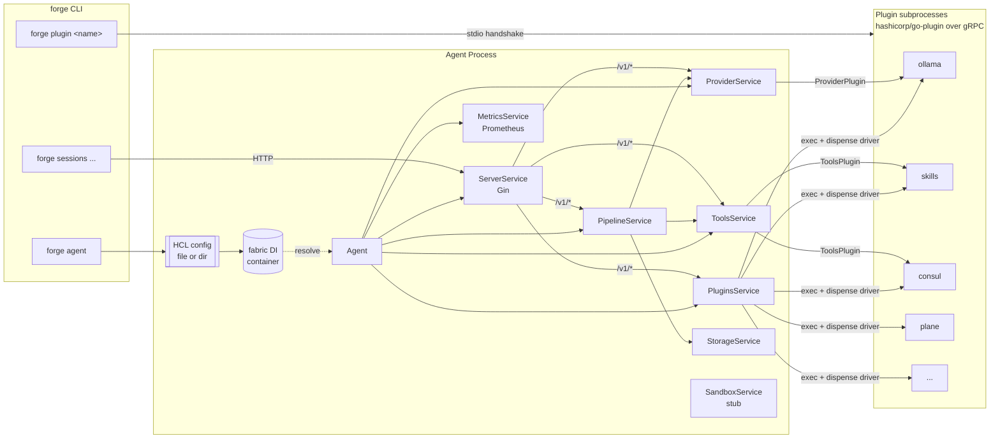
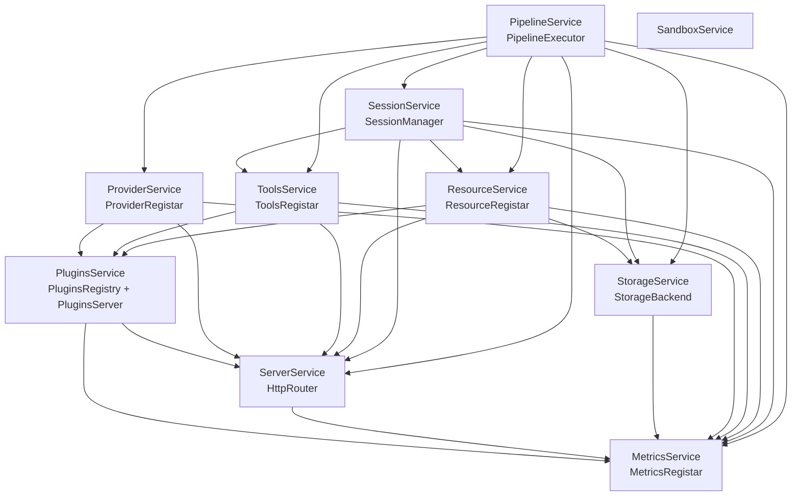
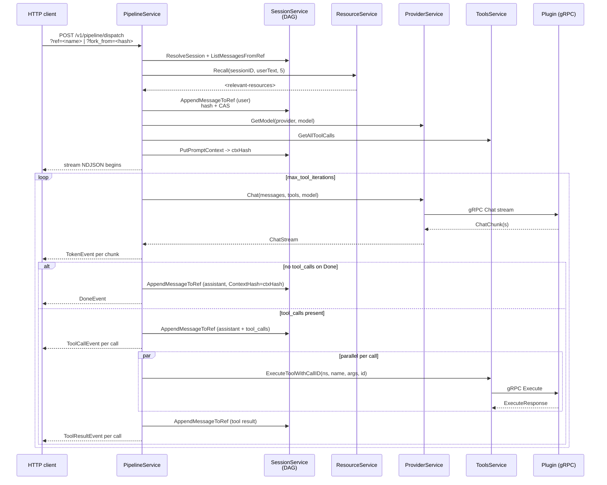
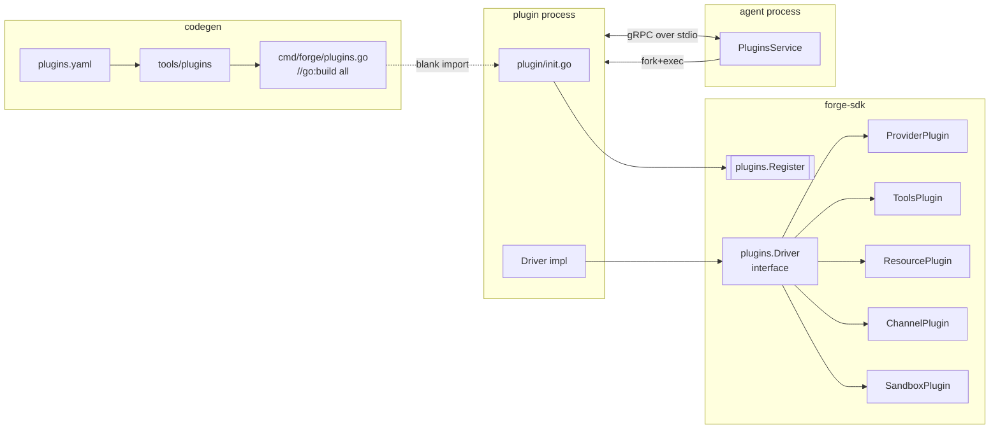

# CLAUDE.md — `service/` (Forge agent)

Guidance for Claude Code working inside `service/`. The monorepo root has its own `CLAUDE.md` with a wider view; this file covers only the main agent binary.

> **Current state (2026-04):** The service has been restructured into a DI-container driven, modular **service-per-subsystem** layout (`internal/service/*`). The old monolithic packages (`internal/registry`, `internal/server`, `internal/session`, `internal/metrics`, `internal/storage`, `internal/sandbox`, `internal/channel`) are gone — the deletions still show up in `git status` until the working tree is committed. Anything still living in `old_code/` is reference material, not a build target.

## Build Commands

Uses [Task](https://taskfile.dev/) and Go 1.25+.

```bash
task setup      # go mod download && go mod tidy
task generate   # regenerate cmd/forge/plugins.go + swagger docs
task build      # generate + compile static binary -> ./build/forge
task run        # generate + go run with tests/config/
task release    # multi-arch docker buildx push
```

Direct:

```bash
# Manifest-driven plugin imports + swagger
go run ./tools/plugins -manifest plugins.yaml -out cmd/forge
swag init -g cmd/forge/main.go -o docs --parseInternal

# Build (the `all` tag enables every generated plugin import)
CGO_ENABLED=0 GOOS=linux go build -tags all -trimpath \
    -ldflags '-s -w -extldflags "-static"' \
    -o ./build/forge ./cmd/forge

go run -tags all ./cmd/forge agent --config ./tests/config/ --log-level DEBUG
```

`plugins.yaml` is the source of truth for which plugins get compiled in. The generator writes `cmd/forge/plugins.go` with `//go:build all` and blank-imports each plugin's `plugin` subpackage; each of those packages calls `plugins.Register(...)` in its `init()`.

## High-Level Architecture



### Service interface

All subsystems in `internal/service/*` implement:

```go
type Service interface {
    container.LifecycleService  // Init(ctx) error + Cleanup(ctx) error
    Serve(ctx context.Context) error
}
```

`service.UnimplementedService` gives no-op defaults. Each subsystem registers itself in `init()` via `container.Register[*T](container.AsSingleton(), container.With[Iface]())`, exposing a narrow interface that other services depend on.

### DI container (fabric)

The project uses `github.com/mwantia/fabric/pkg/container`. Struct tags wire dependencies at resolve time:

| Tag | Meaning |
|---|---|
| `fabric:"inject"` | Resolve another singleton by its registered interface/type. |
| `fabric:"config"` | Inject the full `*config.AgentConfig`. |
| `fabric:"config:<block>"` | Decode the named HCL block (via `ConfigTagProcessor`) into the field's type. Slice fields collect all matching blocks; scalar fields take the first. |
| `fabric:"logger:<name>"` | Named `hclog.Logger` child. |

The `ConfigTagProcessor` (`internal/config/processor.go`) is registered globally at `init()` and given the parsed `*AgentConfig` via `config.SetConfig()` right after `config.Parse()` returns. That timing matters — nothing may call `container.Resolve` before `SetConfig` runs.

### Sub-service dependency graph



Agent (`internal/agent/agent.go`) is the top-level orchestrator. It:

1. Calls `plugins.ServePluginsFrom(ctx, cfg.PluginDir)` to launch every enabled plugin subprocess and cache the driver handles.
2. Calls `providers.Serve(ctx)` and `toolsSvc.Serve(ctx)` to enumerate loaded drivers and pull `ProviderPlugin`/`ToolsPlugin` handles + tool definitions.
3. Spawns goroutines for `ServerService.Serve`, `MetricsService.Serve`, and `PipelineService.Serve`.
4. On shutdown, calls `Cleanup` on plugins, server, and metrics.

`container.LifecycleService.Init(ctx)` runs once per singleton during resolution and is where each service wires routes, registers metrics, and reads config.

## Session Pipeline



**Tool naming:** tools are registered as `namespace__name` (double underscore, e.g. `skills__list_files`, `resource__recall`, `sessions__archive_session`). `PipelineService.executeToolCall` splits on `__` to find the registrar entry, then forwards the bare name to the plugin's `Execute()`.

**Branching:** `?ref=<name>` dispatches against an existing branch; `?fork_from=<hash>` resolves the hash, finds its `ParentHash`, and creates a fresh `fork-<8hex>[-N]` ref pointing at that parent — so editing an old message branches off it without disturbing `HEAD`. The chosen ref is returned as `X-Forge-Ref` and CAS-advanced for every message of the turn; concurrent dispatches on the same branch surface as `409 Conflict` with the actual current tip.

**Replay:** every turn's `PromptContext` (provider + model + message hashes + tool catalog hash + options) is canonicalized and stored. `GET /v1/contexts/:hash` returns the raw object, `/materialized` re-renders the system messages, and `POST /:hash/replay` re-dispatches *without* persisting — useful for diffing model behaviour across providers or reproducing a bug.

**Streaming format:** `POST /v1/pipeline/dispatch` responds with `application/x-ndjson`. Each line is a `WireEvent { type, data }` — see `pipeline/events.go` for the envelope and concrete event shapes (`TokenEvent`, `ToolCallEvent`, `ToolResultEvent`, `ErrorEvent`, `DoneEvent`).

## Plugin System



- **Packaging:** each plugin lives in a sibling module (`plugins/<name>/`) and publishes a `plugin` subpackage whose `init()` calls `plugins.Register(name, description, factory)`. Blank-imported plugins can be served from the same binary via `forge plugin <name>`. Out-of-tree plugins remain standalone binaries placed under `plugin_dir` and named to match the block's `type` label.
- **Runtime:** `PluginsService.ServePluginsFrom` iterates `PluginConfig` blocks, resolves the binary path (explicit `runtime { path = ... }`, then `<plugin_dir>/<type>`, then falls back to `os.Executable() plugin <type>` for embedded plugins), launches it via `hashicorp/go-plugin` with the `pluginsgrpc.Handshake` + `pluginsgrpc.Plugins`, dispenses the `driver`, calls `ConfigDriver` + `OpenDriver`, and caches the handle with capabilities.
- **Capability gating:** `ProviderService.Serve`, `ToolsService.Serve`, and `ResourceService.Serve` skip drivers whose corresponding `DriverCapabilities.*` field is nil. Channel and Sandbox capabilities are declared in the SDK but no service currently consumes them.

## Configuration

HCL. A single file or a directory of `*.hcl` files (merged top-level attributes + blocks).

```hcl
# top-level
plugin_dir = "./plugins"

# reusable constants accessible as meta.* inside other blocks (WIP — see
# processor.go TODO)
meta {
  env = "dev"
}

server {
  address = "127.0.0.1:9280"
  token   = "optional-bearer"
  swagger { path = "/swagger" }
}

metrics {
  address = "127.0.0.1:9500"
  token   = ""
}

storage "file" {
  path = "./data"
}

provider {
  model "prometheus" {
    base_model = "ollama/glm-5.1:cloud"
    reasoning  = true
    system     = "..."
    options { temperature = 0.7 }
    cost_per_input_token  = 0
    cost_per_output_token = 0
  }
}

pipeline {
  max_tool_iterations = 10
  builtin_prompts     = []
}

plugin "ollama" "ollama" {
  # optional — per-plugin runtime overrides
  runtime {
    path    = "/opt/forge/plugins/ollama"
    timeout = "30s"
    port { min = 10000  max = 25000 }
    env { OLLAMA_HOST = "http://127.0.0.1:11434" }
  }

  # driver-specific HCL body passed as map[string]any to ConfigDriver
  config {
    address = "http://127.0.0.1:11434"
  }
}
```

HCL values resolve through `forge-sdk/pkg/template` — `${env("X")}`, `${now()}`, `${uuid()}`, `${file("./x")}` and friends are available inside plugin `env` / `config` blocks and in the top-level eval.

**Model routing.** `PipelineService` splits `session.Metadata.Model` on `/` into `provider/model`. `ProviderService` adds a virtual `forge/` namespace: `forge/<alias>` looks up `provider { model "<alias>" { ... } }` and re-dispatches to the real provider using `base_model` (with `<provider>/` prefix stripped).

**Model aliases.** The `provider { model "..." }` block defines a named alias: `base_model` is the underlying provider model, `system` is prepended as a system message, `options` becomes generation parameters, and `cost_per_*_token` feeds usage accounting.

## HTTP API

Mounted under `/v1/`. The `ServerService` exposes two Gin groups — `public` (unauthenticated) and `auth` (bearer-required when `server.token != ""`). Sub-services mount their own subgroups via `HttpRouter.AuthGroup(prefix)`.

```
GET    /v1/health                                     # public

GET    /v1/plugins                                    /v1/plugins/:name[/capabilities]
GET    /v1/provider                                   /v1/provider/models
GET    /v1/provider/:name[/models[/:model]]

GET    /v1/tools                                      /v1/tools/:namespace[/:name]
POST   /v1/tools/:namespace/:name/execute[/:callid]

# Sessions — owns metadata, message log, refs, archive/clone
GET    /v1/sessions                                   # list (filter by ?parent=<id>)
POST   /v1/sessions                                   # create (name unique per deployment)
GET    /v1/sessions/:session_id                       # by ID or name
DELETE /v1/sessions/:session_id

GET    /v1/sessions/:session_id/messages              # walk HEAD chronologically
GET    /v1/sessions/:session_id/messages/:msg_id      # :msg_id is a hash or ≥4-char prefix
PATCH  /v1/sessions/:session_id/messages/compact      # rewrites HEAD without tool turns
PATCH  /v1/sessions/:session_id/messages/summarize    # 501 (not implemented)

GET    /v1/sessions/:session_id/refs                  # name -> hash map
POST   /v1/sessions/:session_id/refs                  # create (CAS from "")
PATCH  /v1/sessions/:session_id/refs/:ref             # CAS move; expected_hash optional
DELETE /v1/sessions/:session_id/refs/:ref

POST   /v1/sessions/:session_id/archive               # walk ref -> envelope -> resource store; flips immutable
POST   /v1/sessions/:session_id/clone                 # replay envelope into a fresh live session

# Pipeline — dispatch + replay
POST   /v1/pipeline/dispatch                          # NDJSON stream; ?ref=<name> | ?fork_from=<hash>
POST   /v1/pipeline/preview                           # render the prompt without sending it

# Contexts — observability for recorded PromptContexts
GET    /v1/contexts/:hash                             # raw object
GET    /v1/contexts/:hash/materialized                # rendered system messages
POST   /v1/contexts/:hash/replay                      # NDJSON stream; no persistence

# Resources — long-term memory; per-namespace
GET    /v1/resources                                  # backend status
POST   /v1/resources/:namespace                       # store
GET    /v1/resources/:namespace                       # list
GET    /v1/resources/:namespace/recall?q=...          # semantic-ish recall
GET    /v1/resources/:namespace/:id
DELETE /v1/resources/:namespace/:id                   # forget
```

`POST /v1/pipeline/dispatch` returns `application/x-ndjson`. Each line is a
`{ "type": "token|tool_call|tool_result|error|done", "data": {...} }`
envelope (see `pipeline/events.go`). Response headers include
`X-Forge-Ref` so clients know which branch was advanced.

`POST /v1/sessions/.../archive` returns a `ArchiveResult` with the
resource ID + namespace; pass that ID (or the source session ID) to
`/clone` to fork a live successor. Mutations on archived sessions return
`409 Conflict` with `ErrSessionArchived`.

Swagger UI at `GET /swagger/index.html` when `server { swagger {} }` is set.

Prometheus: `GET /metrics` on the metrics server, with optional bearer `metrics { token = "..." }`.

## Storage & DAG layout

`StorageBackend` is a flat K/V-with-prefix interface
(`ReadRaw/ReadJson/WriteRaw/WriteJson/CreateEntry/ListEntry/DeleteEntry/DeletePrefix`).
The `file` backend maps keys directly onto `filepath.Join(root, key)`. Important
contract: `ReadRaw` returns `(nil, nil)` for missing keys — never an empty
slice — so the DAG layer can use `len(b) == 0` as "absent".

Sessions are persisted as a content-addressed Merkle DAG. Layout:

```
objects/<aa>/<rest-of-hash>                       # immutable blobs (MessageObj, PromptContext, ToolCatalog)
sessions/<id>/session.json                        # SessionMetadata (incl. ArchivedAt)
sessions/<id>/refs/<ref-name>                     # mutable hash pointer (HEAD, branches, fork-*)
sessions/<id>/log/<020d-unix_nano>_<hash>.json    # MessageMeta sidecar (CreatedAt, ContextHash, SessionID)
resources/<namespace>/<id>.json                   # built-in ResourcePlugin fallback (incl. archives)
```

Three packages own this:

- `internal/service/session/dag/` — `ObjectStore` (PutIfAbsent / GetMessage /
  GetPromptContext / GetToolCatalog), `RefStore` (Read / Write / CAS / List /
  Delete; per-key in-process mutex), `Walk(refOrHash, limit, offset)`.
- `internal/service/session/storage.go` — `dagSessionStore` glues the above
  with the per-session metadata and log layout.
- `shared/pkg/contenthash/` — canonical JSON encoder + SHA-256; the only
  legitimate way to compute a content hash. Direct `json.Marshal` + hash is a
  bug.

`MessageObj`s never carry timestamps or session IDs — those live in the
sidecar log entry — so byte-identical turns dedup across sessions and
across replays. Compaction (`messages/compact`) rewrites the active
branch with all `tool` turns + tool-only assistant turns removed, leaving
the original chain as orphaned objects (collected by a future `forge gc`).

Swapping the backend = add a `case "kv"` branch in `StorageService.Init`
returning a type that implements `StorageBackend`; the DAG layer rebinds
automatically.

## Key Files

| Path | Role |
|---|---|
| `cmd/forge/main.go` | Cobra root. Blank-imports every `internal/service/*` package to trigger their `init()` registrations. |
| `cmd/forge/server/agent.go` | `forge agent`: parse config → `SetConfig` → `container.Resolve[*Agent]` → `Serve`. |
| `cmd/forge/server/plugin.go` | `forge plugin`: serve a compiled-in plugin as a subprocess. |
| `cmd/forge/client/sessions.go` | `forge sessions` HTTP client commands. |
| `internal/agent/agent.go` | Orchestrator; owns the Serve/Cleanup lifecycle. |
| `internal/config/parse.go` | HCL file + directory parsing. |
| `internal/config/processor.go` | `fabric:"config:<block>"` tag resolver. |
| `internal/service/service.go` | Core `Service` interface. |
| `internal/service/plugins/serve.go` | Plugin subprocess lifecycle. |
| `internal/service/pipeline/pipeline.go` | LLM + tool-call loop, event emission. Hashes messages, advances refs via CAS, stamps `ContextHash`. |
| `internal/service/pipeline/handlers.go` | `/v1/pipeline/dispatch` + `/preview`; resolves `?ref=` / `?fork_from=`; renders `<relevant-resources>` per turn. |
| `internal/service/pipeline/contexts.go` | `/v1/contexts/:hash[/materialized]` + `/replay` (no persistence). |
| `internal/service/pipeline/prompt.go` | Cache-friendly system-prompt assembly: agent → builtins → model → plugins → session → resources. |
| `internal/service/session/service.go` | `/v1/sessions/...` route mount + DI registration. |
| `internal/service/session/storage.go` | `dagSessionStore`: object pool + per-session metadata, refs, log entries. |
| `internal/service/session/manager.go` | `SessionManager` interface — the surface other services consume. |
| `internal/service/session/refs.go` | Ref CRUD handlers (CAS-aware; 409 on archived). |
| `internal/service/session/archive.go` | Archive envelope build + clone replay. Defines `ErrSessionArchived`. |
| `internal/service/session/dag/` | `ObjectStore`, `RefStore`, `Walk`, types. |
| `internal/service/sessionctx/sessionctx.go` | Caller-session context-key carrier; lets `resource` resolve "the current session" without an import cycle. |
| `internal/service/resource/registar.go` | `ResourceRegistar` interface (`Store/Recall/Forget/List/Get`). |
| `internal/service/resource/store.go` | Built-in file-backed fallback + `pluginResourceStore` for `ResourcePlugin`. |
| `shared/pkg/contenthash/contenthash.go` | Canonical JSON + SHA-256 hex. The only valid hash path. |
| `internal/service/provider/registar.go` | Model aliasing, `forge/` virtual namespace, Chat/Embed dispatch. |
| `internal/service/tools/registar.go` | `namespace__name` registration + execution. |
| `internal/service/storage/service.go` | Storage backend selection + instrumentation. |
| `tools/plugins/main.go` | Codegen for `cmd/forge/plugins.go` from `plugins.yaml`. |

## Quick guide: adding a new sub-service

1. New package under `internal/service/<name>/`.
2. Define a narrow interface (e.g. `FooRegistar`) that peers will inject.
3. Create the struct embedding `service.UnimplementedService` and fabric-tagged fields for deps.
4. Register in `init()`:
   ```go
   container.Register[*FooService](
       container.AsSingleton(),
       container.With[FooRegistar](),
   )
   ```
5. Implement `Init` (route mounting, metric registration, config validation). If it owns a long-lived loop, implement `Serve` and have `Agent.Serve` spawn it.
6. Add a blank reference in `cmd/forge/main.go` so the package's `init()` runs.

## Known Gaps & Conventions

- `SandboxService` is a stub (`internal/service/sandbox/service.go`). The SDK still exports a `SandboxPlugin` interface but no service consumes it.
- `ChannelPlugin` is defined in the SDK but there is no `internal/service/channel/`.
- Session-tool fallbacks: `dispatch_session` returns "not yet implemented"; `handleSummarizeMessages` returns 501. Everything else under `sessions__*` is wired (incl. `archive_session`, `clone_archived_session`).
- No `forge gc` yet — compaction and forks leave orphaned objects in `objects/`. Expect this to grow; lock removal behind explicit user request.
- `internal/config/agent.go` no longer carries `data_dir`; persistence lives under `storage "file" { path = ... }`.
- Most plugins under `../plugins/**` are still mid-migration to the new SDK and won't compile. Only the ones listed in `plugins.yaml` (currently `skills`, `plane`, `consul`, `ollama`) are expected to build with the `all` tag.
- OpenViking `ResourcePlugin` adapter is referenced in `docs/03` but not in this repo. It plugs into `internal/service/resource/` without service-side changes — schema_version 1 of the archive envelope is the contract.

### Conventions specific to the DAG layer

- **Never compute a hash without `shared/pkg/contenthash`.** Direct `json.Marshal` + sha256 will produce non-canonical bytes (Go map iteration is randomized) and silently break dedup.
- **Never set `MessageObj.Hash` from caller code.** The hash is the canonical encoding of the whole object; it falls out of `ObjectStore.PutMessage`.
- **CAS, not blind write.** `RefStore.Write` exists for archive/clone-style bootstrapping. Pipeline code uses `CAS(expected → next)` so concurrent dispatches surface as 409, not lost writes.
- **Mutation paths must call `ensureNotArchived`.** Already wired for `AppendMessage*`, `WriteRef`, `CASRef`, `DeleteRef`. New mutation entry points need the same guard.

## Commit & Review Conventions

- Keep sub-service packages narrow: a public interface (`*Registar` / `*Registry` / `*Router`) + an implementing struct. Don't spill internal types across package boundaries.
- When adding a fabric tag processor, register it in an `init()` that runs before `container.Resolve`.
- Route registration belongs in `Init`, not `Serve`. `Serve` should only run the long-lived loop.
- Metrics: register Prometheus collectors in `Init` via the injected `MetricsRegistar`, not global `MustRegister`.
- NDJSON streaming: always flush after `Writer.Write`. Use `WireEvent` — never leak concrete `PipelineEvent` types over the wire.
- Swagger annotations on HTTP handlers: use `map[string]any` (or `map[string]string` for error bodies) in `@Success` / `@Failure` tags. `swag init` cannot resolve cross-module types like `plugins.Resource` or other `forge-sdk` types from inside `service/` — referencing them breaks `task generate`. If a precise response schema is needed, declare a local response struct in the same handler package and reference that.
