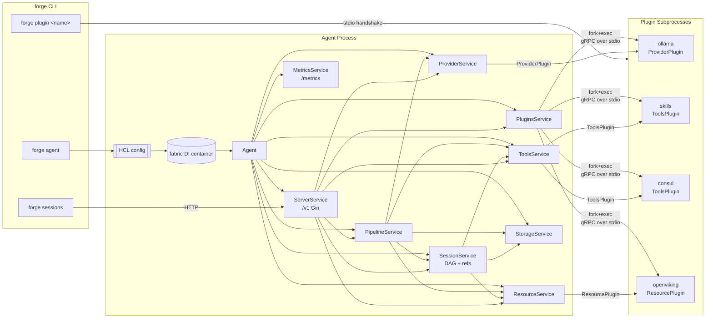

# Forge

> [!WARNING]
> This project is in **early development** and is **not production-ready**.
> Expect broken plugins, missing features, and frequent breaking changes to config schema and APIs.
> Do not deploy in production or critical environments.

Forge is a modular, pluggable AI agent framework written in Go. The agent exposes a REST + NDJSON streaming API, persists sessions as a content-addressed Merkle DAG (immutable messages + git-style refs) on top of a pluggable storage backend, and drives providers / tools / long-term memory through gRPC plugin subprocesses.

The SDK (`forge-sdk`) and plugin modules are published separately. This repository contains the agent process only.

## Features

- **Sessions as a Merkle DAG** — every message is content-addressed; identical
  turns dedup across sessions and replays. No UUIDs.
- **Branching + fork-on-edit** — `?ref=<name>` dispatches against an existing
  branch, `?fork_from=<hash>` creates a fresh `fork-*` ref off the message's
  parent. Concurrent dispatches on the same branch surface as `409 Conflict`,
  not lost writes.
- **Replayable prompts** — the exact prompt sent to a provider is persisted
  as a `PromptContext` blob and exposed via `/v1/pipeline/contexts/:hash` +
  `forge replay`. Non-determinism becomes a debuggable, reproducible problem.
- **Streaming pipeline** — bounded tool-execution loop, emitted to clients as
  NDJSON (`TokenEvent`, `ToolCallEvent`, `ToolResultEvent`, `DoneEvent`).
- **Resources** — long-term memory backed by the same content-addressed DAG as
  sessions. Named resources version like git refs: overwriting a name advances
  the ref and chains `ParentHash`, giving history, diff, and revert for free.
  Semantic recall via HNSW when `embed_model` is set; falls back to substring
  scoring otherwise. Per-turn `<relevant-resources>` block injected into the prompt.
- **Archive + clone** — declare a session immutable, push its log through the
  resource layer; later, replay the envelope into a fresh live session whose
  HEAD points at the archived tip. Lineage tracked via `parent_session_id`.
- **gRPC plugin system** via `hashicorp/go-plugin`. Plugins can either be
  compiled into the agent binary (served via `forge plugin <name>`) or run as
  external binaries placed under `plugin_dir`.
- **Pluggable storage** — `StorageBackend` interface with a file backend today.
- **HCL configuration** — single file or directory; reusable expressions via
  `${env(...)}`, `${now()}`, `${uuid()}`, …
- **Prometheus metrics** on a separate HTTP listener, with optional bearer auth.
- **Embedded Swagger UI** for the REST API.
- **Object-store GC** — `forge system gc` walks every session ref, marks
  reachable `MessageObj` / `PromptContext` / `ToolCatalog` blobs, and sweeps
  the rest. Explicit invocation only; never runs automatically.
- **Live log streaming** — `forge system monitor [--log-level <level>]` opens
  a long-lived connection and tails server logs in real time via a registered
  `hclog.SinkAdapter`.
- **CLI** — `forge sessions branch|checkout|edit|show|reset|log`,
  `forge system monitor|gc`, `forge contexts show`, `forge replay`.

## Architecture Overview



Every subsystem implements a tiny shared interface:

```go
type Service interface {
    container.LifecycleService       // Init(ctx) error + Cleanup(ctx) error
    Serve(ctx context.Context) error
}
```

…registers itself as a singleton in `init()`, exposes a narrow interface for its peers to `fabric:"inject"`, and reads its HCL config via `fabric:"config:<block>"`. `internal/agent/agent.go` is the orchestrator that spins up long-lived servers (`ServerService`, `MetricsService`, `PipelineService`) and wires plugin subprocesses up to `ProviderService` / `ToolsService`.

## Installation

### Prerequisites

- Go **1.25+**
- [Task](https://taskfile.dev/) (optional, used by the default workflows)
- `swag` CLI (`go install github.com/swaggo/swag/cmd/swag@latest`) if you regenerate swagger manually

### Build

Forge compiles in a set of plugins at build time through a code-generation step driven by `plugins.yaml`:

```yaml
plugins:
  - name: skills
    module: github.com/mwantia/forge-plugin-skills
    import: ./plugin
    local: ..
  - name: ollama
    module: github.com/mwantia/forge-plugin-ollama
    import: ./plugin
    local: ..
  # …
```

The `local:` fields become `replace` directives in `go.mod` pointing at the sibling plugin modules in this monorepo; flip them to real module paths for an out-of-tree build.

```bash
task setup      # go mod download && go mod tidy
task generate   # cmd/forge/plugins.go + docs/
task build      # -> ./build/forge  (static, tagged `all`)
```

Direct:

```bash
go run ./tools/plugins -manifest plugins.yaml -out cmd/forge
swag init -g cmd/forge/main.go -o docs --parseInternal
CGO_ENABLED=0 GOOS=linux go build -tags all -trimpath \
    -ldflags '-s -w -extldflags "-static"' \
    -o ./build/forge ./cmd/forge
```

The `all` build tag is what activates the generated blank-imports in `cmd/forge/plugins.go`. Building without it produces a working agent that can still host external plugin binaries — it just won't have any compiled-in.

### Run

```bash
./build/forge agent --config ./tests/config/
```

`--config` accepts either a single `.hcl` file or a directory (all `*.hcl` inside are merged).

```bash
./build/forge sessions list --http-addr http://127.0.0.1:9280
./build/forge plugin ollama     # serve a compiled-in plugin
```

### Docker

`Dockerfile` produces a minimal image; `task release` builds multi-arch and pushes.

## Configuration

A small annotated example:

```hcl
plugin_dir = "./plugins"

server {
  address = "127.0.0.1:9280"
  token   = ""                  # empty = no auth on /v1/*
  swagger { path = "/swagger" }
}

metrics {
  address = "127.0.0.1:9500"
}

storage "file" {
  path = "./data"
}

pipeline {
  max_tool_iterations = 10
}

provider {
  model "prometheus" {
    base_model = "ollama/glm-5.1:cloud"
    reasoning  = true
    system     = <<-EOH
      You are Prometheus, ...
      Current date: ${date("2006-01-02", now())}
    EOH
    options { temperature = 0.7 }
  }
}

# Optional: semantic indexing + custom mounts.
# embed_model must name a declared model of type "embed".
# When set, Store embeds content → HNSW; Recall embeds query → HNSW search.
resource {
  embed_model = "nomic-embed"   # e.g. provider { model "nomic-embed" { base_model = "..." } }

  # Mount specific path prefixes to different backends (optional).
  # Unmatched paths use the built-in DAG store.
  mount "openviking" {
    path = "/global"
  }
}

plugin "ollama" "ollama" {
  runtime {
    timeout = "30s"
    env { OLLAMA_HOST = "${env("OLLAMA_HOST")}" }
  }
  config {
    address = "http://127.0.0.1:11434"
  }
}

plugin "skills" "skills" {
  config { path = "./skills" }
}
```

Full reference lives in [`CLAUDE.md`](CLAUDE.md).

## REST API

Served on `server.address`. All `/v1/*` routes require `Authorization: Bearer <token>` when `server.token` is non-empty. `GET /v1/health` is public.

```
GET    /v1/health

GET    /v1/plugins[/:name[/capabilities]]
GET    /v1/provider[/:name/models[/:model]]
GET    /v1/tools[/:ns[/:name]]
POST   /v1/tools/:ns/:name/execute[/:id]

# Sessions: metadata, DAG message log, branches, archive/clone
GET    /v1/sessions                         POST   /v1/sessions
GET    /v1/sessions/:id                     DELETE /v1/sessions/:id
GET    /v1/sessions/:id/messages            # walk HEAD chronologically
GET    /v1/sessions/:id/messages/:hash      # :hash accepts ≥4-char prefix
PATCH  /v1/sessions/:id/messages/compact    # rewrites HEAD without tool turns
PATCH  /v1/sessions/:id/messages/summarize  # 501 not implemented

GET    /v1/sessions/:id/messages/:a/diff/:b       # Myers diff on Content of two messages
GET    /v1/sessions/:id/branch                    POST   /v1/sessions/:id/branch
PATCH  /v1/sessions/:id/branch/:ref               DELETE /v1/sessions/:id/branch/:ref
POST   /v1/sessions/:id/branch/:ref/revert        # hard CAS revert; body: {"to":"<hash>"}

POST   /v1/sessions/:id/archive             # build envelope, store, flip immutable
POST   /v1/sessions/:id/clone               # replay envelope into fresh live session

# Pipeline: dispatch + observability
POST   /v1/pipeline/commit                  # NDJSON; ?ref=<name> | ?fork_from=<hash>
POST   /v1/pipeline/preview                 # render the prompt without sending it
GET    /v1/pipeline/contexts/:hash          /v1/pipeline/contexts/:hash/materialized
POST   /v1/pipeline/contexts/:hash/replay   # NDJSON; no persistence

# System: observability + maintenance
GET    /v1/system/monitor                   # stream server logs; ?level=trace|debug|info|warn|error
POST   /v1/system/gc                        # GC pass; returns {total, kept, swept}

# Resources: DAG-backed long-term memory; dispatch on path suffix
GET    /v1/resources                        # backend status + mount table
PUT    /v1/resources/*path                  # store; body: {name?, content, tags?, metadata?}
GET    /v1/resources/*path                  # list
POST   /v1/resources/*path                  # recall (RecallQuery body; HNSW when embed_model set)
PATCH  /v1/resources/*path  ?name=          # update tags/metadata (no content change)
DELETE /v1/resources/*path  ?id=            # forget
GET    /v1/resources/*path/history  ?name=  # version history (ParentHash chain)
GET    /v1/resources/*path/diff  ?name=[&from=<hash>][&to=<hash>]   # Myers diff
GET    /v1/resources/*path/versions/<hash>  # fetch historical ResourceObj by hash
POST   /v1/resources/*path/revert  ?name=   # CAS ref to prior hash; body: {"to":"<hash>"}
```

`POST /v1/pipeline/dispatch` responds with `application/x-ndjson`. Each line is a `{ "type": "token|tool_call|tool_result|error|done", "data": {...} }` envelope — see `internal/service/pipeline/events.go`. The active branch is returned as `X-Forge-Ref`.

Mutating operations on archived sessions (`AppendMessage*`, ref CRUD) return `409 Conflict` with `ErrSessionArchived`. CAS conflicts on a busy branch likewise return 409 with the actual current tip in the body.

## Working with sessions and branches

Sessions are git-shaped. Every dispatch advances a ref; you can branch, fork
off an old message, or replay a recorded prompt against a different model.

### Create + dispatch

```bash
# Create a session (name must be unique per deployment)
curl -X POST http://127.0.0.1:9280/v1/sessions \
  -H 'Content-Type: application/json' \
  -d '{"name":"demo","model":"forge/assistant"}'

# Dispatch on HEAD (default)
curl -N -X POST http://127.0.0.1:9280/v1/pipeline/dispatch \
  -H 'Content-Type: application/json' \
  -d '{"session":"demo","content":"hello"}'
# Response is application/x-ndjson; X-Forge-Ref tells you which branch advanced.
```

### Branches

```bash
# List branches
curl http://127.0.0.1:9280/v1/sessions/demo/refs

# Create a branch off a specific message hash
curl -X POST http://127.0.0.1:9280/v1/sessions/demo/refs \
  -d '{"name":"experiment","hash":"<message-hash>"}'

# Dispatch on the branch (HEAD stays untouched)
curl -N -X POST 'http://127.0.0.1:9280/v1/pipeline/dispatch?ref=experiment' \
  -d '{"session":"demo","content":"different angle"}'
```

### Edit-old-message → fork

`?fork_from=<hash>` resolves the message, finds its `ParentHash`, and creates
a fresh `fork-<8hex>[-N]` ref pointing at the parent — so the new turn
descends from the same context the original did, but on its own branch.

```bash
curl -N -X POST 'http://127.0.0.1:9280/v1/pipeline/dispatch?fork_from=ab12cd' \
  -d '{"session":"demo","content":"rewritten user turn"}'
# X-Forge-Ref: fork-ab12cd34
```

### Replay a recorded prompt

Every turn writes a `PromptContext` blob whose hash is stamped onto the
assistant message it produced.

```bash
# Inspect
curl http://127.0.0.1:9280/v1/pipeline/contexts/<hash>
curl http://127.0.0.1:9280/v1/pipeline/contexts/<hash>/materialized

# Re-dispatch (no persistence). Pass {"model":"forge/other"} to A/B providers.
curl -N -X POST http://127.0.0.1:9280/v1/pipeline/contexts/<hash>/replay \
  -d '{"model":"forge/another"}'
```

### Resources (long-term memory)

Resources are stored on the same content-addressed DAG as session messages.
A resource has a human-readable **name** within a **path namespace**. Overwriting
the same name chains the new content to the previous via `ParentHash` — the full
revision history is always traversable.

```bash
# Store (name is optional; if omitted, derived from content hash)
curl -X PUT http://127.0.0.1:9280/v1/resources/sessions/demo \
  -d '{"name":"preferences","content":"user prefers terse answers","tags":["preference"]}'

# Recall — HNSW semantic search when embed_model is configured,
# substring fallback otherwise
curl -X POST http://127.0.0.1:9280/v1/resources/sessions/demo \
  -d '{"query":"terse","limit":3}'

# Recall with glob (always substring-scored)
curl -X POST http://127.0.0.1:9280/v1/resources/sessions/** \
  -d '{"query":"preferences"}'

# List all resources at a path
curl http://127.0.0.1:9280/v1/resources/sessions/demo

# Version history
curl 'http://127.0.0.1:9280/v1/resources/sessions/demo/history?name=preferences'

# Diff (defaults to parent → current tip)
curl 'http://127.0.0.1:9280/v1/resources/sessions/demo/diff?name=preferences'

# Fetch any historical version
curl http://127.0.0.1:9280/v1/resources/sessions/demo/versions/<content-hash>

# Revert to a prior version
curl -X POST 'http://127.0.0.1:9280/v1/resources/sessions/demo/revert?name=preferences' \
  -d '{"to":"<content-hash>"}'

# Forget
curl -X DELETE 'http://127.0.0.1:9280/v1/resources/sessions/demo?id=preferences'
```

The pipeline calls `Recall(sessionID, userMessage, 5)` per turn and renders
the hits as a `<relevant-resources>` block in the prompt. Failures are silent.

Built-in tools `resource__store`, `resource__recall`, `resource__forget` let the
LLM manage memory itself.

### Archive + clone

```bash
# Archive: walk the named ref, build a schema_version=1 envelope, push it
# through the resource layer, flip ArchivedAt. Subsequent commits return 409.
curl -X POST http://127.0.0.1:9280/v1/sessions/demo/archive \
  -d '{"ref":"HEAD"}'
# -> { "session_id": "...", "resource_id": "...", "namespace": "archives", ... }

# Clone: replay the envelope into a fresh live session whose HEAD is the
# archived tip; lineage recorded as parent_session_id.
curl -X POST http://127.0.0.1:9280/v1/sessions/demo/clone \
  -d '{"name":"demo-resumed"}'
```

Built-in tools `sessions__archive_session` and `sessions__clone_archived_session`
expose the same flows to the LLM.

### CLI cheatsheet

```bash
forge sessions status                               # list all sessions
forge sessions create   --name foo --model forge/assistant
forge sessions dispatch <id> "hello"               # stream a turn

forge sessions branch   <id>                       # list branches
forge sessions branch   <id> <name>                # create at HEAD
forge sessions branch   <id> -m <old> <new>        # rename
forge sessions branch   <id> -d <name>             # delete
forge sessions checkout <id> <branch>              # switch HEAD
forge sessions checkout <id> -b <new-branch>       # create + switch

forge sessions log      <id>                       # walk HEAD chain
forge sessions edit     <id> <msg-hash>            # open $EDITOR; re-dispatch as fork_from
forge sessions show     <id> <msg-hash>            # print a single message
forge sessions reset    <id>                       # regenerate system message from plugins
forge sessions messages compact <id>               # strip tool turns from HEAD

forge system monitor    --log-level debug          # tail server logs
forge system gc                                    # sweep unreachable objects

forge contexts show     <ctx-hash>
forge contexts replay   <ctx-hash> --model forge/other
```

## Project Layout

```
cmd/forge/
├── main.go                # cobra root + blank-imports for init() registration
├── generate.go            # go:generate directives
├── plugins.go             # GENERATED by tools/plugins (tag: all)
├── swagger.go             # swagger annotations anchor
├── client/                # `forge sessions ...` HTTP client
└── server/                # `forge agent`, `forge plugin`
internal/
├── agent/                 # lifecycle orchestrator
├── config/                # HCL parsing + fabric config tag processor
├── log/                   # hclog colour wrapper
└── service/
    ├── service.go         # Service interface
    ├── default.go         # UnimplementedService
    ├── metrics/           # Prometheus listener + MetricsRegistar
    ├── server/            # Gin + HttpRouter (+ public/auth groups)
    ├── storage/           # StorageBackend interface + file backend
    ├── plugins/           # gRPC plugin subprocess lifecycle
    ├── provider/          # LLM provider dispatch + model aliases
    ├── tools/             # Namespaced tool registry + execution (namespace__name)
    ├── session/           # SessionService + DAG-backed store
    │   └── dag/           #   ObjectStore, RefStore, Walk, types
    ├── sessionctx/        # caller-session context-key carrier (no deps)
    ├── resource/          # ResourceRegistar (Store/Recall/Forget) + archive sink
    ├── pipeline/          # Dispatch loop, contexts API, NDJSON streaming
    ├── system/            # /v1/system/monitor (log sink SSE) + /v1/system/gc
    └── sandbox/           # (stub)
tools/plugins/             # plugins.yaml -> cmd/forge/plugins.go codegen
tests/                     # compose.yml + HCL fixtures
docs/                      # generated swagger artefacts
plugins.yaml               # which plugins get compiled in
taskfile.yml
Dockerfile
build/                     # output
```

## Known Limitations

1. **Sandbox is a stub.** `SandboxService` implements `Service` but does nothing. The SDK still exports `SandboxPlugin`. Either wire it up or delete it.
2. **No channel subsystem.** `ChannelPlugin` exists in the SDK but there is no `internal/service/channel/` — the old dispatcher lives in `old_code/channel`.
3. **`commit_session` and `summarize` are stubs.** `sessions__commit_session` returns "not yet implemented"; `PATCH /v1/sessions/:id/messages/summarize` returns 501. Compaction works.
4. **OpenViking adapter not in this repo.** Archives go to the built-in DAG store under `resources/archives/` until the external plugin lands. Schema_version 1 of the archive envelope is the stable contract.
5. **`pluginResourceStore` is a shim.** External plugins using the old `ResourcePlugin` interface only support `Store`, `Recall`, and `Forget`. History, versioning, patching, and diff are unavailable on plugin-backed mounts. Migration path: implement `RecallPlugin` (in `shared/pkg/plugins/recall.go`).
6. **HNSW glob recall falls back to substring.** Paths containing `*`, `?`, or `[` skip the HNSW index. Only exact-namespace queries with a non-empty `query` field use HNSW.
7. **HNSW indexing is eventually consistent.** `Store` fires indexing in a background goroutine. A resource may not appear in semantic recall immediately after being stored.
8. **Config processor caveat.** `internal/config/processor.go` — `meta {}` is parsed but not yet exposed as `meta.*` inside sub-blocks (only the top-level eval has it via the template engine).
9. **Cleanup chain is partial.** `Agent.Cleanup` only calls `plugins.Cleanup`, `srv.Cleanup`, `met.Cleanup`. `SessionService` and `ResourceService` aren't awaited.
10. **Auth is a single shared token.** Fine for dev, bad for multi-tenant. No audit log.
11. **No automated tests.** `tests/` holds fixtures only; feature surfaces are validated via the CLI and `/preview`.
12. **Plugin path resolution has three fallbacks** (explicit path → `plugin_dir/type` → `os.Executable() plugin <type>`). The third branch silently turns a missing external plugin into an embedded one.
13. **Graceful shutdown is best-effort.** Server + metrics have 10s timeouts; plugins are killed, not drained. In-flight tool calls are abandoned.

## License

See [`LICENSE`](LICENSE).
