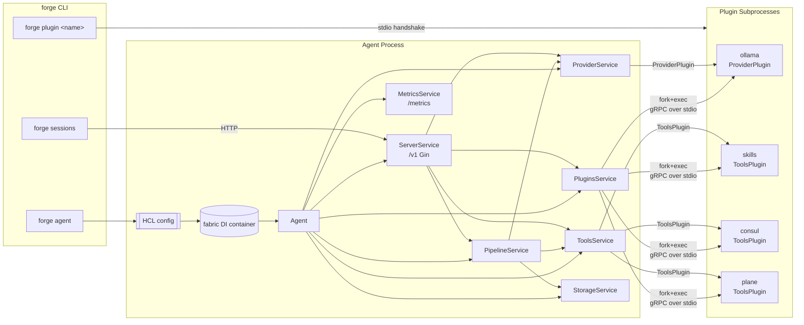

# Forge

> [!WARNING]
> This project is in **early development** and is **not production-ready**.
> Expect broken plugins, missing features, and frequent breaking changes to config schema and APIs.
> Do not deploy in production or critical environments.

Forge is a modular, pluggable AI agent framework written in Go. The agent exposes a REST + NDJSON streaming API, persists sessions to a pluggable storage backend, and drives LLM providers / tools / memory through gRPC plugin subprocesses.

The agent binary you build from this module is one piece of a larger monorepo:

- `service/` (this module) — the agent process.
- `shared/` — the `forge-sdk` module with plugin interfaces, gRPC transport, template engine, and the shared REST client.
- `plugins/*/` — standalone plugin modules. Most are currently mid-migration to the new SDK and don't build cleanly yet.

## What's here now

Recent work rebuilt the agent around a dependency-injection container and split every subsystem into its own package under `internal/service/*`. The previous monolith (`internal/registry`, `internal/server`, `internal/session`, `internal/metrics`, `internal/storage`, …) has been deleted; anything still living under `old_code/` is reference material, not a build target.

Feature highlights:

- **Sessions + tool-call pipeline** — streaming LLM responses with a bounded tool-execution loop, emitted to clients as NDJSON (`TokenEvent`, `ToolCallEvent`, `ToolResultEvent`, `DoneEvent`).
- **gRPC plugin system** via `hashicorp/go-plugin`. Plugins can either be compiled into the agent binary (served via `forge plugin <name>`) or run as external binaries placed under `plugin_dir`.
- **Pluggable storage** — `StorageBackend` interface with a file backend today.
- **HCL configuration** — single file or directory; reusable expressions via `${env(...)}`, `${now()}`, `${uuid()}`, …
- **Prometheus metrics** on a separate HTTP listener, with optional bearer auth.
- **Embedded Swagger UI** for the REST API.
- **`forge sessions` CLI** for driving a running agent from the terminal.

## Architecture Overview



Every subsystem implements a tiny shared interface:

```go
type Service interface {
    container.LifecycleService       // Init(ctx) error + Cleanup(ctx) error
    Serve(ctx context.Context) error
}
```

…registers itself as a singleton in `init()`, exposes a narrow interface for its peers to `fabric:"inject"`, and reads its HCL config via `fabric:"config:<block>"`. `internal/agent/agent.go` is the orchestrator that spins up long-lived servers (`ServerService`, `MetricsService`, `PipelineService`) and wires plugin subprocesses up to `ProviderService` / `ToolsService`.

For a deeper dive including sequence diagrams and the full config/API surface, see [`CLAUDE.md`](CLAUDE.md).

## Installation

### Prerequisites

- Go **1.25+**
- [Task](https://taskfile.dev/) (optional, used by the default workflows)
- `swag` CLI (`go install github.com/swaggo/swag/cmd/swag@latest`) if you regenerate swagger manually

### Build

Forge compiles in a set of plugins at build time through a code-generation step driven by `plugins.yaml`:

```yaml
plugins:
  - name: skills
    module: github.com/mwantia/forge-plugin-skills
    import: ./plugin
    local: ../plugins/skills
  - name: ollama
    module: github.com/mwantia/forge-plugin-ollama
    import: ./plugin
    local: ../plugins/ollama
  # …
```

The `local:` fields become `replace` directives in `go.mod` pointing at the sibling plugin modules in this monorepo; flip them to real module paths for an out-of-tree build.

```bash
task setup      # go mod download && go mod tidy
task generate   # cmd/forge/plugins.go + docs/
task build      # -> ./build/forge  (static, tagged `all`)
```

Direct:

```bash
go run ./tools/plugins -manifest plugins.yaml -out cmd/forge
swag init -g cmd/forge/main.go -o docs --parseInternal
CGO_ENABLED=0 GOOS=linux go build -tags all -trimpath \
    -ldflags '-s -w -extldflags "-static"' \
    -o ./build/forge ./cmd/forge
```

The `all` build tag is what activates the generated blank-imports in `cmd/forge/plugins.go`. Building without it produces a working agent that can still host external plugin binaries — it just won't have any compiled-in.

### Run

```bash
./build/forge agent --config ./tests/config/
```

`--config` accepts either a single `.hcl` file or a directory (all `*.hcl` inside are merged).

```bash
./build/forge sessions list --http-addr http://127.0.0.1:9280
./build/forge plugin ollama     # serve a compiled-in plugin
```

### Docker

`Dockerfile` produces a minimal image; `task release` builds multi-arch and pushes.

## Configuration

A small annotated example:

```hcl
plugin_dir = "./plugins"

server {
  address = "127.0.0.1:9280"
  token   = ""                  # empty = no auth on /v1/*
  swagger { path = "/swagger" }
}

metrics {
  address = "127.0.0.1:9500"
}

storage "file" {
  path = "./data"
}

pipeline {
  max_tool_iterations = 10
}

provider {
  model "prometheus" {
    base_model = "ollama/glm-5.1:cloud"
    reasoning  = true
    system     = <<-EOH
      You are Prometheus, ...
      Current date: ${date("2006-01-02", now())}
    EOH
    options { temperature = 0.7 }
  }
}

plugin "ollama" "ollama" {
  runtime {
    timeout = "30s"
    env { OLLAMA_HOST = "${env("OLLAMA_HOST")}" }
  }
  config {
    address = "http://127.0.0.1:11434"
  }
}

plugin "skills" "skills" {
  config { path = "./skills" }
}
```

Full reference lives in [`CLAUDE.md`](CLAUDE.md).

## REST API

Served on `server.address`. All `/v1/*` routes require `Authorization: Bearer <token>` when `server.token` is non-empty. `GET /v1/health` is public.

```
GET    /v1/health

GET    /v1/plugins                          /v1/plugins/:name/capabilities
GET    /v1/provider                         /v1/provider/:name/models/:model
GET    /v1/tools                            /v1/tools/:ns/:name
POST   /v1/tools/:ns/:name/execute[/:id]

GET    /v1/pipeline/sessions
POST   /v1/pipeline/sessions
GET    /v1/pipeline/sessions/:id            DELETE /v1/pipeline/sessions/:id
GET    /v1/pipeline/sessions/:id/messages   POST   /v1/pipeline/sessions/:id/messages
GET    /v1/pipeline/sessions/:id/messages/:msg_id
PATCH  /v1/pipeline/sessions/:id/messages/compact
PATCH  /v1/pipeline/sessions/:id/messages/summarize    # 501 not implemented
```

`POST .../messages` responds with `application/x-ndjson`. Each line is a `{ "type": "token|tool_call|tool_result|error|done", "data": {...} }` envelope — see `internal/service/pipeline/events.go`.

## Project Layout

```
service/
├── cmd/forge/
│   ├── main.go                # cobra root + blank-imports for init() registration
│   ├── generate.go            # go:generate directives
│   ├── plugins.go             # GENERATED by tools/plugins (tag: all)
│   ├── swagger.go             # swagger annotations anchor
│   ├── client/                # `forge sessions ...` HTTP client
│   └── server/                # `forge agent`, `forge plugin`
├── internal/
│   ├── agent/                 # lifecycle orchestrator
│   ├── config/                # HCL parsing + fabric config tag processor
│   ├── log/                   # hclog colour wrapper
│   └── service/
│       ├── service.go         # Service interface
│       ├── default.go         # UnimplementedService
│       ├── metrics/           # Prometheus listener + MetricsRegistar
│       ├── server/            # Gin + HttpRouter (+ public/auth groups)
│       ├── storage/           # StorageBackend interface + file backend
│       ├── plugins/           # gRPC plugin subprocess lifecycle
│       ├── provider/          # LLM provider dispatch + model aliases
│       ├── tools/             # Namespaced tool registry + execution
│       ├── pipeline/          # Session + message pipeline (SSE/NDJSON)
│       └── sandbox/           # (stub)
├── tools/plugins/             # plugins.yaml -> cmd/forge/plugins.go codegen
├── tests/                     # compose.yml + HCL fixtures
├── docs/                      # generated swagger artefacts
├── plugins.yaml               # which plugins get compiled in
├── taskfile.yml
├── Dockerfile
└── build/                     # output
```

## Evaluation of the current structure

### What works well

- **Separation is real, not cosmetic.** Each subsystem exports only an interface (`ToolsRegistar`, `ProviderRegistar`, `PluginsRegistry`, `HttpRouter`, `StorageBackend`, `MetricsRegistar`, `PipelineExecutor`). Peers inject interfaces rather than concrete structs, so swapping in alternate implementations (an in-memory storage backend, a different HTTP stack, a fake tools registrar for tests) does not require touching dependents.
- **Route ownership is co-located with the subsystem.** Pipeline handlers live in `pipeline/handlers.go`, tool handlers in `tools/handlers.go`, etc. No more central `api/` grab-bag to keep in sync.
- **Codegen-driven plugins.** `plugins.yaml` is a single, reviewable source of truth for what ships in a build. The `all` tag keeps the "kitchen sink" build opt-in.
- **Config composition.** HCL directory merging + the template engine (`${env()}`, `${file()}`, `${uuid()}`) cover most real-world deployment needs without bespoke env-var interpolation.
- **Metrics everywhere.** Each subsystem registers its own collectors in `Init`, so adding metrics to a new feature is local to that feature's package.
- **Streaming is first-class.** NDJSON `WireEvent` decouples on-the-wire format from the typed `PipelineEvent` ADT — transport adapters (SSE, WebSocket, gRPC server-streaming) can be added without touching the pipeline.

### Rough edges and open problems

1. **Sandbox is a stub.** `SandboxService` implements `Service` but does nothing. The SDK still exports `SandboxPlugin`. Either wire it up or delete it.
2. **No channel subsystem.** `ChannelPlugin` exists in the SDK but there is no `internal/service/channel/` — the old dispatcher lives in `old_code/channel`. Ditto for the sub-session dispatcher tools.
3. **Tool executor is mostly empty.** `pipeline/tools.go::ExecuteTool` only handles `session_set_title`. Every other entry in `pipeline/definitions.go` (`read_session`, `list_sub_sessions`, `create_session`, `dispatch_session`, `list_message_history`, `read_message`, …) is advertised to the LLM but errors on execution.
4. **Plugins in `../plugins/**` don't match the current SDK.** Most plugin modules need a refresh to the new `Driver` surface and capability declarations. Only the four in `plugins.yaml` (skills, plane, consul, ollama) are expected to build.
5. **`handleSummarizeMessages` is 501.** The companion compact endpoint works; summarize needs an LLM-assisted implementation.
6. **Config processor caveat.** `internal/config/processor.go` holds `TODO :: Find a solution to dynamically register 'meta' for sub-blocks` — `meta {}` is parsed but not yet exposed as `meta.*` inside other blocks (only the top-level eval has it via the template engine, not gohcl's decode context).
7. **Cleanup chain is partial.** `Agent.Cleanup` only calls `plugins.Cleanup`, `srv.Cleanup`, `met.Cleanup`. `PipelineService`, `StorageService`, `ProviderService`, `ToolsService` aren't awaited. In the current code nothing under those services holds long-lived resources beyond what plugins own, but the invariant is fragile.
8. **Locking is cargo-culted.** Several services take `mu.Lock()` around read-only operations (e.g. `ServerService.Serve` takes a write lock before `ListenAndServe`, which then blocks with the lock held). No deadlock today but worth a pass.
9. **Plugin path resolution has three fallbacks** (explicit path → `plugin_dir/type` → `os.Executable() plugin <type>`). The third branch silently turns a missing external plugin into an embedded one; at minimum it should log which branch it picked.
10. **Auth is a single shared token.** Fine for dev, bad for multi-tenant. No audit log of auth successes/failures.
11. **No integration tests.** `tests/` holds fixtures only. There's no `_test.go` file anywhere under `internal/service/*` (at least none checked in right now).
12. **Tool name format divergence.** Runtime uses `namespace__name` (double underscore). The root `CLAUDE.md` in the monorepo still describes `namespace/name`. Pick one and update both.
13. **`forge` virtual provider** is a sharp edge: `provider.Chat("forge", alias, ...)` strips `<provider>/` off `base_model`, but everywhere else model strings flow as `"provider/model"` literal. Worth documenting as part of the provider interface contract.
14. **Graceful shutdown is best-effort.** Server + metrics have 10s shutdown timeouts; plugins are killed, not asked to drain. In-flight tool calls are abandoned.

### Suggested next steps

Ordered roughly by ratio of payoff to effort:

1. **Finish the pipeline tool executor.** Implement the remaining `sessions/*` tools in `pipeline/tools.go`, or extract them into a dedicated sub-service (`internal/service/session-tools/`) that `PipelineService` depends on.
2. **Resurrect or remove sandbox + channel.** If sub-session dispatch and channel routing still matter, port `old_code/channel` + `old_code/sandbox` to the new `Service` layout; otherwise drop the corresponding SDK interfaces and plugin types.
3. **Migrate the broken plugins under `../plugins/**`.** Publish a `shared/docs/plugins-migration.md` once the SDK is stable, then walk each plugin to the new `Driver` interface and capability declaration. Add a matrix of which plugins compile / which are expected to be live.
4. **Tighten `Agent` lifecycle.** Extend `Cleanup` to fan out over every registered `Service` rather than the handful of known ones. Consider running `Serve` via an errgroup with propagating cancellation.
5. **Move `plugins.yaml` → `go.mod replace` story into docs.** Currently undocumented that the `local:` field rewrites `go.mod`. Add a note + a failure mode explanation for CI.
6. **Unit tests for pipeline + provider routing.** `PipelineService.RunSessionPipeline` is the most business-critical code path and is untested. A mock `ProviderRegistar` + `ToolsRegistar` would already cover a lot.
7. **Structured auth.** Replace the single bearer token with scoped tokens (e.g. read-only vs dispatch) and add request-scoped audit fields to the Gin logger.
8. **Config validation pass.** Today most malformed configs are caught at `Init` time per-service, so you get cascade failures. A single `config.Validate(cfg)` after parse would give one coherent error.
9. **Document the meta block.** Decide whether `meta.*` is a global eval-context feature or a per-block one, implement it (the TODO in `processor.go`), and document it in the HCL reference.
10. **Publish the shared CLI.** `forge sessions` is handy but currently undocumented. A short cookbook would help.
11. **CI.** There's no GitHub Actions workflow checked in. At minimum: `task setup && task build` matrix + a lint (`golangci-lint`) job.
12. **Embeddings endpoint.** The old `/v1/embeddings` route isn't present in the new server. Either re-add it under `provider/` or announce its removal.

## License

See [`LICENSE`](LICENSE).
