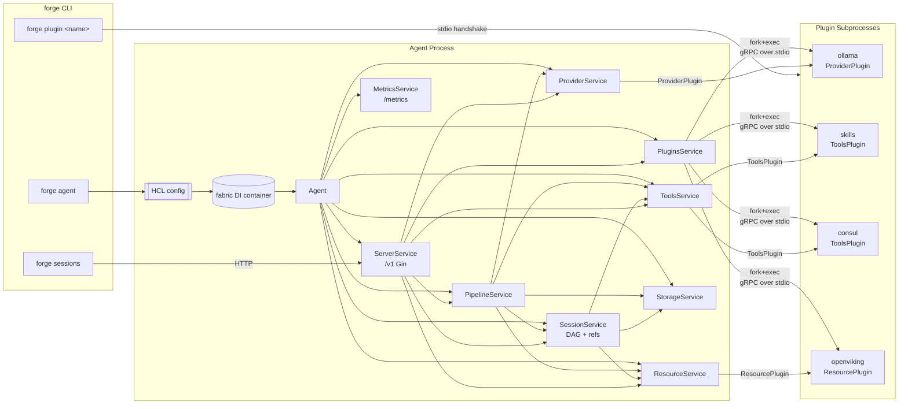

# Forge

> [!WARNING]
> This project is in **early development** and is **not production-ready**.
> Expect broken plugins, missing features, and frequent breaking changes to config schema and APIs.
> Do not deploy in production or critical environments.

Forge is a modular, pluggable AI agent framework written in Go. The agent exposes a REST + NDJSON streaming API, persists sessions as a content-addressed Merkle DAG (immutable messages + git-style refs) on top of a pluggable storage backend, and drives LLM providers / tools / long-term memory through gRPC plugin subprocesses.

The agent binary you build from this module is one piece of a larger monorepo:

- `service/` (this module) — the agent process.
- `shared/` — the `forge-sdk` module with plugin interfaces, gRPC transport, template engine, and the shared REST client.
- `plugins/*/` — standalone plugin modules. Most are currently mid-migration to the new SDK and don't build cleanly yet.

## What's here now

Recent work rebuilt the agent around a dependency-injection container and split every subsystem into its own package under `internal/service/*`. The previous monolith (`internal/registry`, `internal/server`, `internal/session`, `internal/metrics`, `internal/storage`, …) has been deleted; anything still living under `old_code/` is reference material, not a build target.

The session subsystem itself was then re-built on a content-addressed Merkle
DAG (see [`docs/03-proposal-merkle-DAG-concept.md`](../docs/03-proposal-merkle-DAG-concept.md)):
messages are immutable blobs keyed by `sha256(canonical_json(obj))`, and
mutable refs (HEAD, branches, fork-points) layer on top in git-style.

Feature highlights:

- **Sessions as a Merkle DAG** — every message is content-addressed; identical
  turns dedup across sessions and replays. No UUIDs.
- **Branching + fork-on-edit** — `?ref=<name>` dispatches against an existing
  branch, `?fork_from=<hash>` creates a fresh `fork-*` ref off the message's
  parent. Concurrent dispatches on the same branch surface as `409 Conflict`,
  not lost writes.
- **Replayable prompts** — the exact prompt sent to a provider is persisted
  as a `PromptContext` blob and exposed via `/v1/contexts/:hash` +
  `forge replay`. Non-determinism becomes a debuggable, reproducible problem.
- **Streaming pipeline** — bounded tool-execution loop, emitted to clients as
  NDJSON (`TokenEvent`, `ToolCallEvent`, `ToolResultEvent`, `DoneEvent`).
- **Resources** — long-term memory verbs `Store` / `Recall` / `Forget` over a
  `ResourcePlugin` (built-in file fallback today; OpenViking / pgvector / S3
  swappable). Per-turn `<relevant-resources>` block injected into the prompt.
- **Archive + clone** — declare a session immutable, push its log through the
  resource layer; later, replay the envelope into a fresh live session whose
  HEAD points at the archived tip. Lineage tracked via `parent_session_id`.
- **gRPC plugin system** via `hashicorp/go-plugin`. Plugins can either be
  compiled into the agent binary (served via `forge plugin <name>`) or run as
  external binaries placed under `plugin_dir`.
- **Pluggable storage** — `StorageBackend` interface with a file backend today.
- **HCL configuration** — single file or directory; reusable expressions via
  `${env(...)}`, `${now()}`, `${uuid()}`, …
- **Prometheus metrics** on a separate HTTP listener, with optional bearer auth.
- **Embedded Swagger UI** for the REST API.
- **CLI** — `forge sessions list|branch|branches|checkout|log`,
  `forge messages edit`, `forge contexts show`, `forge replay`.

## Architecture Overview



Every subsystem implements a tiny shared interface:

```go
type Service interface {
    container.LifecycleService       // Init(ctx) error + Cleanup(ctx) error
    Serve(ctx context.Context) error
}
```

…registers itself as a singleton in `init()`, exposes a narrow interface for its peers to `fabric:"inject"`, and reads its HCL config via `fabric:"config:<block>"`. `internal/agent/agent.go` is the orchestrator that spins up long-lived servers (`ServerService`, `MetricsService`, `PipelineService`) and wires plugin subprocesses up to `ProviderService` / `ToolsService`.

For a deeper dive including sequence diagrams and the full config/API surface, see [`CLAUDE.md`](CLAUDE.md).

## Installation

### Prerequisites

- Go **1.25+**
- [Task](https://taskfile.dev/) (optional, used by the default workflows)
- `swag` CLI (`go install github.com/swaggo/swag/cmd/swag@latest`) if you regenerate swagger manually

### Build

Forge compiles in a set of plugins at build time through a code-generation step driven by `plugins.yaml`:

```yaml
plugins:
  - name: skills
    module: github.com/mwantia/forge-plugin-skills
    import: ./plugin
    local: ../plugins/skills
  - name: ollama
    module: github.com/mwantia/forge-plugin-ollama
    import: ./plugin
    local: ../plugins/ollama
  # …
```

The `local:` fields become `replace` directives in `go.mod` pointing at the sibling plugin modules in this monorepo; flip them to real module paths for an out-of-tree build.

```bash
task setup      # go mod download && go mod tidy
task generate   # cmd/forge/plugins.go + docs/
task build      # -> ./build/forge  (static, tagged `all`)
```

Direct:

```bash
go run ./tools/plugins -manifest plugins.yaml -out cmd/forge
swag init -g cmd/forge/main.go -o docs --parseInternal
CGO_ENABLED=0 GOOS=linux go build -tags all -trimpath \
    -ldflags '-s -w -extldflags "-static"' \
    -o ./build/forge ./cmd/forge
```

The `all` build tag is what activates the generated blank-imports in `cmd/forge/plugins.go`. Building without it produces a working agent that can still host external plugin binaries — it just won't have any compiled-in.

### Run

```bash
./build/forge agent --config ./tests/config/
```

`--config` accepts either a single `.hcl` file or a directory (all `*.hcl` inside are merged).

```bash
./build/forge sessions list --http-addr http://127.0.0.1:9280
./build/forge plugin ollama     # serve a compiled-in plugin
```

### Docker

`Dockerfile` produces a minimal image; `task release` builds multi-arch and pushes.

## Configuration

A small annotated example:

```hcl
plugin_dir = "./plugins"

server {
  address = "127.0.0.1:9280"
  token   = ""                  # empty = no auth on /v1/*
  swagger { path = "/swagger" }
}

metrics {
  address = "127.0.0.1:9500"
}

storage "file" {
  path = "./data"
}

pipeline {
  max_tool_iterations = 10
}

provider {
  model "prometheus" {
    base_model = "ollama/glm-5.1:cloud"
    reasoning  = true
    system     = <<-EOH
      You are Prometheus, ...
      Current date: ${date("2006-01-02", now())}
    EOH
    options { temperature = 0.7 }
  }
}

plugin "ollama" "ollama" {
  runtime {
    timeout = "30s"
    env { OLLAMA_HOST = "${env("OLLAMA_HOST")}" }
  }
  config {
    address = "http://127.0.0.1:11434"
  }
}

plugin "skills" "skills" {
  config { path = "./skills" }
}
```

Full reference lives in [`CLAUDE.md`](CLAUDE.md).

## REST API

Served on `server.address`. All `/v1/*` routes require `Authorization: Bearer <token>` when `server.token` is non-empty. `GET /v1/health` is public.

```
GET    /v1/health

GET    /v1/plugins[/:name[/capabilities]]
GET    /v1/provider[/:name/models[/:model]]
GET    /v1/tools[/:ns[/:name]]
POST   /v1/tools/:ns/:name/execute[/:id]

# Sessions: metadata, DAG message log, branches, archive/clone
GET    /v1/sessions                         POST   /v1/sessions
GET    /v1/sessions/:id                     DELETE /v1/sessions/:id
GET    /v1/sessions/:id/messages            # walk HEAD chronologically
GET    /v1/sessions/:id/messages/:hash      # :hash accepts ≥4-char prefix
PATCH  /v1/sessions/:id/messages/compact    # rewrites HEAD without tool turns
PATCH  /v1/sessions/:id/messages/summarize  # 501 not implemented

GET    /v1/sessions/:id/refs                POST   /v1/sessions/:id/refs
PATCH  /v1/sessions/:id/refs/:ref           DELETE /v1/sessions/:id/refs/:ref

POST   /v1/sessions/:id/archive             # build envelope, store, flip immutable
POST   /v1/sessions/:id/clone               # replay envelope into fresh live session

# Pipeline: dispatch + preview
POST   /v1/pipeline/dispatch                # NDJSON; ?ref=<name> | ?fork_from=<hash>
POST   /v1/pipeline/preview                 # render the prompt without sending it

# Contexts: replayable PromptContext blobs
GET    /v1/contexts/:hash                   /v1/contexts/:hash/materialized
POST   /v1/contexts/:hash/replay            # NDJSON; no persistence

# Resources: long-term memory + archive sink
GET    /v1/resources                        # backend status
POST   /v1/resources/:ns                    # store
GET    /v1/resources/:ns                    # list (built-in fallback only)
GET    /v1/resources/:ns/recall?q=...       # semantic-ish recall
GET    /v1/resources/:ns/:id                DELETE /v1/resources/:ns/:id  # forget
```

`POST /v1/pipeline/dispatch` responds with `application/x-ndjson`. Each line is a `{ "type": "token|tool_call|tool_result|error|done", "data": {...} }` envelope — see `internal/service/pipeline/events.go`. The active branch is returned as `X-Forge-Ref`.

Mutating operations on archived sessions (`AppendMessage*`, ref CRUD) return `409 Conflict` with `ErrSessionArchived`. CAS conflicts on a busy branch likewise return 409 with the actual current tip in the body.

## Working with sessions and branches

Sessions are git-shaped. Every dispatch advances a ref; you can branch, fork
off an old message, or replay a recorded prompt against a different model.

### Create + dispatch

```bash
# Create a session (name must be unique per deployment)
curl -X POST http://127.0.0.1:9280/v1/sessions \
  -H 'Content-Type: application/json' \
  -d '{"name":"demo","model":"forge/assistant"}'

# Dispatch on HEAD (default)
curl -N -X POST http://127.0.0.1:9280/v1/pipeline/dispatch \
  -H 'Content-Type: application/json' \
  -d '{"session":"demo","content":"hello"}'
# Response is application/x-ndjson; X-Forge-Ref tells you which branch advanced.
```

### Branches

```bash
# List branches
curl http://127.0.0.1:9280/v1/sessions/demo/refs

# Create a branch off a specific message hash
curl -X POST http://127.0.0.1:9280/v1/sessions/demo/refs \
  -d '{"name":"experiment","hash":"<message-hash>"}'

# Dispatch on the branch (HEAD stays untouched)
curl -N -X POST 'http://127.0.0.1:9280/v1/pipeline/dispatch?ref=experiment' \
  -d '{"session":"demo","content":"different angle"}'
```

### Edit-old-message → fork

`?fork_from=<hash>` resolves the message, finds its `ParentHash`, and creates
a fresh `fork-<8hex>[-N]` ref pointing at the parent — so the new turn
descends from the same context the original did, but on its own branch.

```bash
curl -N -X POST 'http://127.0.0.1:9280/v1/pipeline/dispatch?fork_from=ab12cd' \
  -d '{"session":"demo","content":"rewritten user turn"}'
# X-Forge-Ref: fork-ab12cd34
```

### Replay a recorded prompt

Every turn writes a `PromptContext` blob whose hash is stamped onto the
assistant message it produced.

```bash
# Inspect
curl http://127.0.0.1:9280/v1/contexts/<hash>
curl http://127.0.0.1:9280/v1/contexts/<hash>/materialized

# Re-dispatch (no persistence). Pass {"model":"forge/other"} to A/B providers.
curl -N -X POST http://127.0.0.1:9280/v1/contexts/<hash>/replay \
  -d '{"model":"forge/another"}'
```

### Resources (long-term memory)

```bash
# Store
curl -X POST http://127.0.0.1:9280/v1/resources/demo \
  -d '{"content":"user prefers terse answers","metadata":{"kind":"preference"}}'

# Recall (semantic-ish; the built-in fallback is substring-scored)
curl 'http://127.0.0.1:9280/v1/resources/demo/recall?q=preferences&limit=3'

# Forget
curl -X DELETE http://127.0.0.1:9280/v1/resources/demo/<id>
```

The pipeline calls `Recall(sessionID, userMessage, 5)` per turn and renders
the hits into the prompt as a `<relevant-resources>` block. Failures are
silent — never a hard dependency on the resource backend.

The agent also exposes built-in tools `resource__store`, `resource__recall`,
`resource__forget` so the LLM can manage memory itself.

### Archive + clone

```bash
# Archive: walk the named ref, build a schema_version=1 envelope, push it
# through the resource layer, flip ArchivedAt. Subsequent commits return 409.
curl -X POST http://127.0.0.1:9280/v1/sessions/demo/archive \
  -d '{"ref":"HEAD"}'
# -> { "session_id": "...", "resource_id": "...", "namespace": "archives", ... }

# Clone: replay the envelope into a fresh live session whose HEAD is the
# archived tip; lineage recorded as parent_session_id.
curl -X POST http://127.0.0.1:9280/v1/sessions/demo/clone \
  -d '{"name":"demo-resumed"}'
```

Built-in tools `sessions__archive_session` and `sessions__clone_archived_session`
expose the same flows to the LLM.

### CLI cheatsheet

```bash
forge sessions list
forge sessions branches <id>
forge sessions branch    <id> --name foo --hash <msg-hash>
forge sessions checkout  <id> --ref foo
forge sessions log       <id> --graph

forge messages edit      <id> <msg-hash>            # opens $EDITOR; submits as fork_from
forge contexts show      <ctx-hash>
forge replay             <ctx-hash> --model forge/other
```

## Project Layout

```
service/
├── cmd/forge/
│   ├── main.go                # cobra root + blank-imports for init() registration
│   ├── generate.go            # go:generate directives
│   ├── plugins.go             # GENERATED by tools/plugins (tag: all)
│   ├── swagger.go             # swagger annotations anchor
│   ├── client/                # `forge sessions ...` HTTP client
│   └── server/                # `forge agent`, `forge plugin`
├── internal/
│   ├── agent/                 # lifecycle orchestrator
│   ├── config/                # HCL parsing + fabric config tag processor
│   ├── log/                   # hclog colour wrapper
│   └── service/
│       ├── service.go         # Service interface
│       ├── default.go         # UnimplementedService
│       ├── metrics/           # Prometheus listener + MetricsRegistar
│       ├── server/            # Gin + HttpRouter (+ public/auth groups)
│       ├── storage/           # StorageBackend interface + file backend
│       ├── plugins/           # gRPC plugin subprocess lifecycle
│       ├── provider/          # LLM provider dispatch + model aliases
│       ├── tools/             # Namespaced tool registry + execution (namespace__name)
│       ├── session/           # SessionService + DAG-backed store
│       │   └── dag/           #   ObjectStore, RefStore, Walk, types
│       ├── sessionctx/        # caller-session context-key carrier (no deps)
│       ├── resource/          # ResourceRegistar (Store/Recall/Forget) + archive sink
│       ├── pipeline/          # Dispatch loop, contexts API, NDJSON streaming
│       └── sandbox/           # (stub)
├── tools/plugins/             # plugins.yaml -> cmd/forge/plugins.go codegen
├── tests/                     # compose.yml + HCL fixtures
├── docs/                      # generated swagger artefacts
├── plugins.yaml               # which plugins get compiled in
├── taskfile.yml
├── Dockerfile
└── build/                     # output
```

## Evaluation of the current structure

### What works well

- **Separation is real, not cosmetic.** Each subsystem exports only an interface (`ToolsRegistar`, `ProviderRegistar`, `PluginsRegistry`, `HttpRouter`, `StorageBackend`, `MetricsRegistar`, `PipelineExecutor`). Peers inject interfaces rather than concrete structs, so swapping in alternate implementations (an in-memory storage backend, a different HTTP stack, a fake tools registrar for tests) does not require touching dependents.
- **Route ownership is co-located with the subsystem.** Pipeline handlers live in `pipeline/handlers.go`, tool handlers in `tools/handlers.go`, etc. No more central `api/` grab-bag to keep in sync.
- **Codegen-driven plugins.** `plugins.yaml` is a single, reviewable source of truth for what ships in a build. The `all` tag keeps the "kitchen sink" build opt-in.
- **Config composition.** HCL directory merging + the template engine (`${env()}`, `${file()}`, `${uuid()}`) cover most real-world deployment needs without bespoke env-var interpolation.
- **Metrics everywhere.** Each subsystem registers its own collectors in `Init`, so adding metrics to a new feature is local to that feature's package.
- **Streaming is first-class.** NDJSON `WireEvent` decouples on-the-wire format from the typed `PipelineEvent` ADT — transport adapters (SSE, WebSocket, gRPC server-streaming) can be added without touching the pipeline.

### Rough edges and open problems

1. **Sandbox is a stub.** `SandboxService` implements `Service` but does nothing. The SDK still exports `SandboxPlugin`. Either wire it up or delete it.
2. **No channel subsystem.** `ChannelPlugin` exists in the SDK but there is no `internal/service/channel/` — the old dispatcher lives in `old_code/channel`.
3. **`dispatch_session` and `summarize` are stubs.** `sessions__dispatch_session` returns "not yet implemented"; `PATCH /v1/sessions/:id/messages/summarize` returns 501. Compaction works.
4. **No `forge system gc`.** Compaction and forks leave orphaned objects in `objects/<aa>/...`. Disk usage grows monotonically. A `forge system gc` pass that walks every ref and reaps unreferenced blobs is the planned escape hatch.
5. **OpenViking adapter not in this repo.** `docs/03 §7.3` references it as the canonical archive-storage `ResourcePlugin`; until it lands, archives go to the built-in file fallback under `resources/archives/`.
6. **Plugins in `../plugins/**` don't match the current SDK.** Most plugin modules need a refresh to the new `Driver` surface and capability declarations. Only the ones in `plugins.yaml` (currently `skills`, `plane`, `consul`, `ollama`) are expected to build.
7. **Config processor caveat.** `internal/config/processor.go` holds `TODO :: Find a solution to dynamically register 'meta' for sub-blocks` — `meta {}` is parsed but not yet exposed as `meta.*` inside other blocks (only the top-level eval has it via the template engine, not gohcl's decode context).
8. **Cleanup chain is partial.** `Agent.Cleanup` only calls `plugins.Cleanup`, `srv.Cleanup`, `met.Cleanup`. The new services (`SessionService`, `ResourceService`) aren't awaited. Nothing holds long-lived resources beyond what plugins own, but the invariant is fragile.
9. **Locking is cargo-culted.** Several services take `mu.Lock()` around read-only operations. No deadlock today but worth a pass.
10. **Auth is a single shared token.** Fine for dev, bad for multi-tenant. No audit log of auth successes/failures.
11. **No automated tests.** `tests/` holds fixtures only; the project deliberately validates feature surfaces via the CLI / `/preview` rather than unit tests today (see `feedback_skip_tests` memory).
12. **Plugin path resolution has three fallbacks** (explicit path → `plugin_dir/type` → `os.Executable() plugin <type>`). The third branch silently turns a missing external plugin into an embedded one.
13. **Graceful shutdown is best-effort.** Server + metrics have 10s shutdown timeouts; plugins are killed, not asked to drain. In-flight tool calls are abandoned.

### Suggested next steps

Ordered roughly by ratio of payoff to effort:

1. **`forge system gc`.** Walk every ref, mark reachable objects, sweep the rest. Lock behind explicit invocation; never auto-run.
2. **OpenViking `ResourcePlugin`.** Lives in a sibling module. Schema_version 1 of the archive envelope is the contract.
3. **Implement `dispatch_session`.** The other sub-session tools (`create_session`, `list_sub_sessions`, …) are wired; only blocking dispatch is missing.
4. **Resurrect or remove sandbox + channel.** Port `old_code/channel` + `old_code/sandbox` to the new `Service` layout, or drop the SDK interfaces.
5. **Migrate plugins under `../plugins/**`.** Walk each plugin to the new `Driver` interface + capability declaration; publish a migration matrix.
6. **Tighten `Agent` lifecycle.** Extend `Cleanup` to fan out over every registered `Service`. Consider running `Serve` via an errgroup with propagating cancellation.
7. **Structured auth.** Replace the single bearer token with scoped tokens (e.g. read-only vs dispatch) and add request-scoped audit fields.
8. **Document the `meta` block.** Decide global vs per-block, implement, document.
9. **CI.** No GitHub Actions workflow checked in. At minimum: `task setup && task build` matrix + a `golangci-lint` job.
10. **Embeddings endpoint.** The old `/v1/embeddings` route isn't present in the new server. Either re-add it under `provider/` or announce its removal.

## License

See [`LICENSE`](LICENSE).
